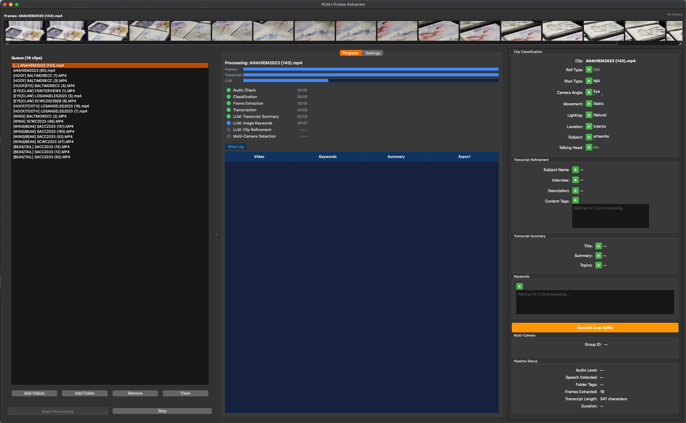

# AutoBin

Automatically log your documentary footage for DaVinci Resolve.

I built this because I got tired of manually tagging hundreds of clips. AutoBin watches your video files, pulls out the important frames, transcribes the audio, figures out what kind of shot it is (interview? B-roll? wide? close-up?), and spits out a CSV that DaVinci Resolve can import directly. The whole thing runs locally on your Mac. No cloud, no subscriptions, no sending your footage anywhere.



## How it works

You drop your footage in, hit Start, and AutoBin runs each clip through this pipeline:

1. **Extract I-frames** from the video using ffmpeg. It auto-tunes the similarity threshold so you get a consistent number of frames per minute regardless of what the footage looks like.
2. **Check audio levels** before transcription. If a clip is basically silent (B-roll, landscape shots, etc.), it skips transcription entirely so Whisper doesn't hallucinate text that isn't there.
3. **Transcribe** the audio with MLX-Whisper (runs natively on Apple Silicon).
4. **Classify the clip** by sending frames to a local vision-language model (Qwen 3.5 via Ollama). It identifies shot type, camera angle, movement, lighting, location, whether someone's talking, A-roll vs B-roll.
5. **Refine using the transcript.** If someone says their name in the interview, AutoBin picks it up. It cross-references the visual classification with what's actually being said.
6. **Generate keywords** by sending frames + transcript summary to the VLM together.
7. **Detect multi-camera angles.** If you shot the same interview from two cameras, AutoBin figures that out by comparing transcripts (same audio, different angles = multicam match).
8. **Export CSV** that maps directly to DaVinci Resolve's metadata columns.

Every field AutoBin generates can be overridden. There's a toggle on each field to switch between the auto-generated value and your own.

## What you need

- **Mac with Apple Silicon** (M1/M2/M3/M4). It works on Intel too but you'll need `faster-whisper` instead of `mlx-whisper`.
- **16GB RAM minimum**, 24GB recommended if you're running the Qwen 3.5 9B model.
- **ffmpeg** and **Ollama** installed on your system. If you don't have them, the app will offer to install them for you on first launch.

## Getting started

### Option 1: Double-click the app

Build the `.app` and launch it like any other Mac application:

```bash
git clone https://github.com/Justrada/autobin.git
cd autobin
python3 -m venv .venv && source .venv/bin/activate
pip install -r requirements.txt
pip install pyinstaller
./build_app.sh
open dist/AutoBin.app
```

On first launch, a setup wizard checks for ffmpeg, Ollama, and the Qwen model. If anything's missing, there's a button to install it right there.

### Option 2: Run from source

```bash
git clone https://github.com/Justrada/autobin.git
cd autobin
python3 -m venv .venv && source .venv/bin/activate
pip install -r requirements.txt
pip install mlx-whisper    # or: pip install faster-whisper
python main.py
```

### Ollama setup

If you don't already have Ollama running:

```bash
brew install ollama
ollama pull qwen3.5:latest
ollama serve
```

## Using it

1. Open the app. If it's your first time, the setup wizard walks you through installing dependencies.
2. Click "Add Files" or "Add Folder" to load your footage. Folders get scanned recursively and subfolder names become tags.
3. Hit "Start" and let it run. You can watch the progress for each clip.
4. Click any clip in the queue to review its metadata on the right side. Toggle any field between Auto (what the pipeline generated) and User (your override).
5. CSVs get exported automatically, per-clip and combined. Import them in DaVinci Resolve via File > Import Metadata > Media Pool.

## Settings

Everything is configurable in the Settings tab and saved to `~/.config/vlm_iframe/settings.json`.

**Ingest:** similarity metric (histogram, SSIM, or perceptual hash), target frames per minute, context frame offset.

**LLM:** backend (Ollama, OpenAI, or Anthropic), model name, context window size, VLM resolution, max images per batch.

**Transcription:** backend (mlx-whisper or faster-whisper), model size (tiny through large), custom vocabulary for name/term biasing, audio check toggle, noise floor threshold.

## What the CSV looks like

The exported CSV maps to DaVinci Resolve's metadata fields:

File Name, Keywords, Description, Comments, Shot Type, Camera Angle, Camera Movement, Lighting, Location, Subject, Roll Type, Subject Name, Interview (yes/no), Content Tags, and Multicam Group (e.g. MC_001 for matched clips).

## Multi-camera detection

This was a fun one to figure out. AutoBin detects multi-cam clips by comparing transcripts. The idea is simple: if two clips have the same audio (because they were filmed at the same time from different angles), their transcripts will be nearly identical even though Whisper transcribes them slightly differently.

It normalizes the text, builds 5-gram sets, slides the shorter transcript across the longer one to handle different start times, and scores the overlap. Anything above 35% with at least 15 matched n-grams gets grouped together.

## Project layout

```
autobin/
    main.py                     # Entry point + setup wizard trigger
    extract_iframes.py          # Standalone CLI for frame extraction
    build_app.sh                # Builds AutoBin.app
    AutoBin.spec                # PyInstaller config

    core/
        schemas.py              # Data models (Pydantic)
        frames.py               # I-frame extraction + auto-threshold
        transcribe.py           # Whisper backends + audio level check
        llm.py                  # Ollama / OpenAI / Anthropic
        token_budget.py         # Image token estimation
        multicam.py             # Transcript similarity matching
        resolve_export.py       # CSV export

    gui/
        main_window.py          # Main window
        setup_wizard.py         # First-run dependency checker
        queue_panel.py          # Video queue
        settings_panel.py       # Settings UI
        progress_panel.py       # Pipeline progress
        metadata_panel.py       # Editable metadata fields
        orchestrator.py         # Pipeline sequencing
        workers.py              # Background thread workers
```

## Contributing

If you want to help out, here are some things I'd love to see:

- FCPXML export so Resolve/Premiere/FCPX can import timelines directly
- Resolve Scripting API integration for live metadata push
- A better progress panel (think status indicator lights, not a log dump)
- Pipeline parallelization so multiple clips move through different stages at the same time
- Linux and Windows testing (I've only tested on macOS so far)

## License

AutoBin is licensed under the [GNU General Public License v3](LICENSE).

**What that means in practice:** you can use it, modify it, share it, whatever you want. The one rule is that if you distribute a modified version, you have to release your source code under the same license. It stays open.

**Commercial licensing:** if you want to use AutoBin in a proprietary product (something you're selling where you don't want to open-source your code), get in touch and we can work out a commercial license. Email me at [TODO: your email] or open an issue on GitHub.
